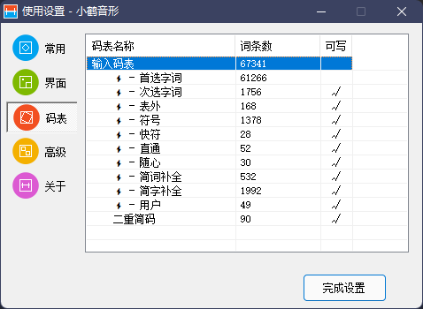

# 简介  

这是一个 **小鹤音形** 的词库  
包括较为常见的 **数学用语**  
现版本 v1.0.0 共包含 49 个词语, 今后会不断更新  

# 使用方法  

1. 将 **本仓库** clone 至本地(也可以复制粘贴 *FlyPY-Math-vX.X.X.txt* 的内容到本地一个新建的 txt 文件中).  
2. 切换至 **小鹤音形** 输入法, 并在任意输入栏输入 **"omb"** (中文模式), 出现如 **图1** 所示的界面后按下空格或者1, 出现如 **图2** 所示 **码表设置界面**  

---

图1

---

图2

---

1. 右击 **用户** 一栏, 点击导入, 选择 **步骤1** 中所下载/创建的 txt 文件并确认.  
2. 此时 **用户** 一栏词条数会发生变化, 点击完成设置即可.  

# 相关链接  

[小鹤音形](https://www.flypy.com/)

~~恬不知耻地推广 [我的 blog](https://kouyou888.com/)~~

# 最后

欢迎大家 fork 或者 issue, 共同丰富词库~